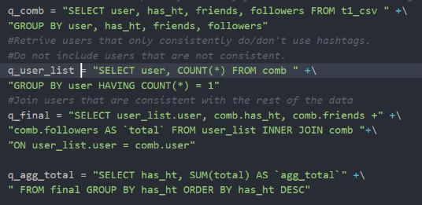

# Final project for Intro to Big Data, SP2017 UMKC

For our final project, I and a team of others developed and built an application to analyze Twitter Tweets using Apache Spark. 

The documentation folder contains more information about the project, along with animated gifs of some of the results. 

To use, put the code on a virtualbox Archlinux system and add the proper network settings; the results produced by the Apache Spark anlysis are served using a python Flask Server, which runs on the virtual ArchLinux. Correct network settings will allow acccess to the localhost webpage from the host machine. 

NOTE: Demo below is not running in real time. Most of the processing time has been cut-out for viewability. 

SQL for Task 1:

TODO:
* Correct presentation with the fixed task 2 (See Source_Code_Documentation for background info)
* Clean up variable names and bring it up to PEP8 (This was built before I began practicing a consistent codeing style)
* Add more comments

Wishlist:
* Switch from Python Flask to Python Django for serving content
* Deploy to Heroku 
